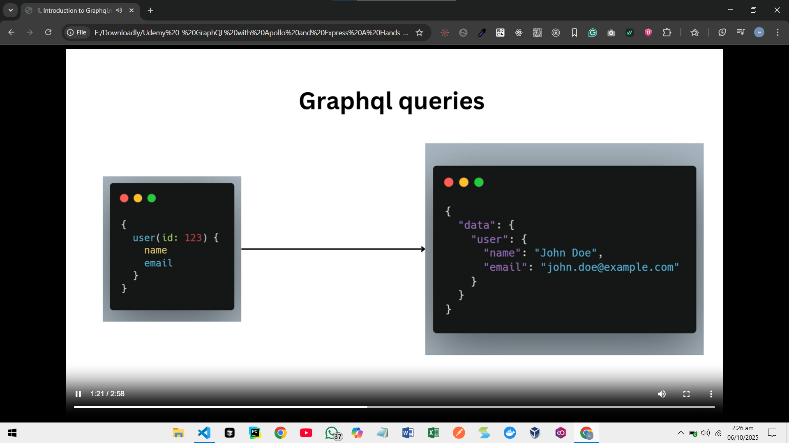
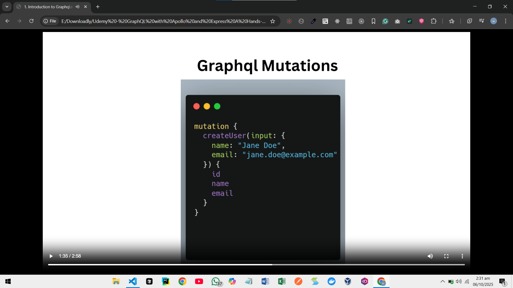

# GraphQL — Next Steps: Cheat Sheet + Practical Guide (Roman Urdu + English)

Yeh follow-up resource aap ke latest notes (grphql.txt) aur images ko use karta hai. Isme Queries, Mutations, Schema (SDL), best practices, pagination/filtering, DataLoader (N+1 fix), caching, security, aur subscriptions ka concise, hands-on overview hai.

---

## Quick mental model: SQL se analogy

- SQL DB ke liye query language hai; GraphQL APIs ke liye query language + runtime hai.
- SQL me aap SELECT columns FROM table likhte ho; GraphQL me aap fields ko specify karte ho jo client ko chahiye.
- GraphQL DB-specific nahi hota; resolvers DB/REST/microservices se data la sakte hain.

---

## Visual references

- Queries overview: 
- Mutations overview: 
- Schema using SDL: 

---

## 1) Queries — request for data

Key ideas based on your note: “it specifies the fields the client wants to retrieve, plus arguments.”

- Basic structure:

```graphql
query OptionalName($var: Int) {
  entity(arg: $var) {
    fieldA
    fieldB
    nested {
      id
      name
    }
  }
}
```

- Arguments: `users(limit: 10, filter: { active: true })`
- Variables: Define `$var` in the operation, pass value separately from client.
- Aliases: Rename fields to avoid collisions.

```graphql
{
  first: user(id: "1") {
    id
    name
  }
  second: user(id: "2") {
    id
    name
  }
}
```

- Fragments: Reuse field selections.

```graphql
fragment UserCard on User {
  id
  name
  avatar
}
query {
  me {
    ...UserCard
  }
  author(id: 5) {
    ...UserCard
  }
}
```

- Directives: `@include(if: $cond)` / `@skip(if: $cond)` for conditional fields.

---

## 2) Mutations — create/update/delete

Your note: “request to create, modify, delete data; it also gets fields/body.”

- Input types keep mutations clean and versionable.

```graphql
mutation CreatePost($input: CreatePostInput!) {
  createPost(input: $input) {
    id
    title
    author {
      id
      name
    }
  }
}
```

- Always return the changed resource shape that the UI needs (not just an ID).
- Server should enforce validation and authorization inside resolvers.

---

## 3) Schema (SDL) — contract b|w client & server

Your note: “types, relationships, what can be queried or mutated.”

- Scalars: `Int, Float, String, Boolean, ID`
- Non-null: `String!` and lists: `[Post!]!`
- Types & relationships:

```graphql
type User {
  id: ID!
  name: String!
  posts: [Post!]!
}
type Post {
  id: ID!
  title: String!
  body: String
  author: User!
}
```

- Enums, Interfaces, Unions, Input types for richer models.
- Pagination-ready fields: prefer connections (see below).

Schema design checklist:

- Names descriptive, consistent case.
- Use input types for mutations.
- Avoid exposing internal IDs if not needed; prefer opaque IDs.
- Add `@deprecated(reason: "...")` on fields instead of breaking changes.

---

## 4) Pagination, filtering, sorting

- Offset pagination (simple): `posts(offset: Int = 0, limit: Int = 20)` — easy but can be inconsistent on rapidly changing data.
- Cursor-based (recommended for feeds):

```graphql
type PostEdge { cursor: String!, node: Post! }

type PostConnection {
  edges: [PostEdge!]!
  pageInfo: { endCursor: String, hasNextPage: Boolean! }
}

type Query {
  postsConnection(after: String, first: Int = 20): PostConnection!
}
```

- Filtering/Sorting via input objects:

```graphql
input PostFilter {
  authorId: ID
  search: String
  tags: [String!]
}
input PostSort {
  field: PostSortField!
  order: SortOrder!
}
```

---

## 5) Common error + N+1 fix (DataLoader)

Problem: Nested resolvers can trigger many per-record DB calls (N+1). Solution: batch by IDs.

Example concept (Node.js):

```js
import DataLoader from 'dataloader'

function createUserLoader(userService) {
  return new DataLoader(async (ids) => {
    const users = await userService.findManyByIds(ids)
    const map = new Map(users.map(u => [u.id, u]))
    return ids.map(id => map.get(id) || null)
  })
}

// In context
const context = ({ req }) => ({
  userLoader: createUserLoader(userService),
})

// In resolver for Post.author
Post: {
  author: (post, _, ctx) => ctx.userLoader.load(post.authorId),
}
```

---

## 6) Caching basics

- Client-side (Apollo Client): normalized cache; define key fields and type policies.

```js
new InMemoryCache({
  typePolicies: {
    Query: {
      fields: {
        postsConnection: relayStylePagination(),
      },
    },
  },
});
```

- Server-side: response caching for idempotent queries, resolver-level memoization, DataLoader, persisted queries.
- CDN: enable GET for persisted queries to leverage edge caching.

---

## 7) Security & stability

- Depth/complexity limits and timeouts to prevent expensive queries.
- AuthN/AuthZ: attach user to context; enforce at field resolvers where needed.
- Persisted/whitelisted queries to block arbitrary payloads in public apps.
- Error masking: return safe messages to clients; log detailed errors server-side.

---

## 8) Subscriptions (real-time)

- Use WebSockets for reactive updates.

```graphql
type Subscription {
  postAdded: Post!
}
```

Client receives updates:

```graphql
subscription OnPostAdded {
  postAdded {
    id
    title
  }
}
```

Ensure proper auth and backpressure control.

---

## 9) Mini “from notes to practice” lab

- Start with the SDL image as guide (types + relationships).
- Implement Query: list posts with limit/filter; test in GraphiQL.
- Implement Mutation: create/update post via input types; return the new/updated node.
- Add DataLoader to fix N+1 on `Post.author`.
- Add cursor pagination via `PostConnection`.
- Add depth limit and persisted queries for safety.

---

## 10) Quick FAQ (recap)

- Is GraphQL a DB query language? Nahi — yeh API layer ke liye hai.
- Versioning? Deprecations + additive changes; avoid breaking removals.
- File upload? Use multipart spec or separate REST endpoint.
- REST ya GraphQL? Complex aggregation/multiple clients → GraphQL; simple, cache-heavy public API → REST; internal high-performance RPC/streaming → gRPC.

---

## 11) `server.js` explained (line-by-line)

File: `graphql-app/server.js`

```js
import { ApolloServer } from "@apollo/server";
import { startStandaloneServer } from "@apollo/server/standalone";

const typeDefs = `#graphql
  type Query {
    hello: String!
  }
`;

const resolvers = {
  Query: {
    hello: () => "Hello GraphQL",
  },
};

const server = new ApolloServer({ typeDefs, resolvers });

const { url } = await startStandaloneServer(server, {
  listen: { port: process.env.PORT ? Number(process.env.PORT) : 4000 },
});

console.log(`🚀 Server ready at ${url}`);
```

- `import { ApolloServer } from '@apollo/server'`

  - ESM import (ES modules) use ho raha hai. `ApolloServer` GraphQL server instance banata hai jo aap ke schema + resolvers ko host karta hai.

- `import { startStandaloneServer } from '@apollo/server/standalone'`

  - Quick bootstrap helper jo HTTP server create kar deta hai (Express waghera ki zaroorat nahi). Dev/test ke liye perfect.

- `const typeDefs = \`#graphql ...\``

  - SDL (Schema Definition Language) string. `#graphql` comment tooling ko hint deta hai for syntax highlighting.
  - Yahan ek simple `Query` type define hai jis me `hello: String!` field hai.

- `const resolvers = { Query: { hello: () => 'Hello GraphQL' } }`

  - Resolver functions batate hain data kahan se aayega. `hello` field ke liye yeh function constant string return karta hai.

- `const server = new ApolloServer({ typeDefs, resolvers })`

  - Server instance create ho gaya with your schema + resolvers.

- `const { url } = await startStandaloneServer(server, { listen: { port: ... } })`

  - Top-level `await` (ESM) se server start kar rahe hain. Port env se le raha hai warna `4000` use karega.
  - Return me `url` milta hai, jo aap ko GraphQL endpoint/landing page ka address deta hai (e.g., `http://localhost:4000/`).

- `console.log(\`🚀 Server ready at ${url}\`)`
  - Startup confirmation. Browser me iss URL ko open karein; Apollo ki landing page/Sandbox se query run kar sakte hain.

### Try it quickly

- Terminal (Windows cmd):
  - Install deps, then run dev:
    - `npm install`
    - `npm run dev`
- Browser me open karein: printed URL (e.g., `http://localhost:4000/`).
- Query run karein:

```graphql
query {
  hello
}
```

Expected response:

```json
{
  "data": { "hello": "Hello GraphQL" }
}
```

### Notes and tips

- ES Modules: Package me `"type": "module"` set hai, is liye top-level `await` aur `import` kaam karta hai.
- Node version: Apollo Server v4 ke liye modern Node (>=16) recommended.
- Production ke liye: auth (context), validation, depth/complexity limits, logging, and error masking add karein. Express integration bhi possible hai agar aap middlewares use karna chahen.

---

Further learning:

- Official: https://graphql.org/learn/
- Apollo Docs: https://www.apollographql.com/docs/
- Best practices: https://graphql.org/learn/best-practices/

Agar aap chahen, main is guide ke saath ek tiny runnable Apollo Server starter yahin repo me add kar sakta hoon (schema + resolvers + sample queries).
